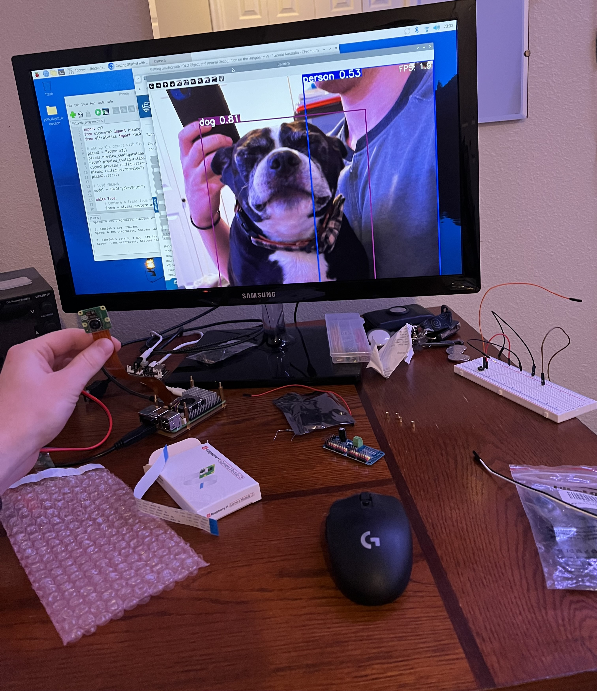

Perfect 👍 — here’s your README updated with a ready-to-display **dog image section**. I placed it after the **Overview** so it shows up near the top, and added a sample Markdown snippet pointing to `assets/my_dog.jpg`. Once you drop your image file in the repo, GitHub will automatically render it.

---

# Automated Dog Door

## Overview

This project is an automated dog door designed to let dogs go outside independently without leaving the door open. The system uses dual cameras, YOLO-based object detection, and servos to automatically open and close door panels when a dog is detected.

## Meet the Dog

Here’s one of the dogs this project was designed for:



*(To display your own image, place it inside an `assets/` folder in the repository and make sure the filename matches. GitHub will show the image automatically in the README.)*

## Motivation

I have three dogs (two boxers and a Boston terrier), and my mom finds it difficult to let them out frequently. Leaving the door open wastes heating/cooling. This project automates the process, improves convenience, and ensures only the dogs can trigger the door.

## Features

* Dual Raspberry Pi Camera Module 3 for indoor/outdoor detection.
* YOLOv8 object detection model with multiprocessing batch inference to leverage multiple CPU cores.
* Motion-activated cameras using ultrasonic distance sensors to reduce power consumption.
* Servo-driven door mechanism powered by a PCA9685 PWM controller for smooth operation.
* Automatic recovery from temporary camera disconnections.
* Power monitoring and usage tracking.

## Hardware

* Raspberry Pi 5 (controller)
* 4 × MG996R servos (door panels)
* PCA9685 PWM driver
* 2 × Raspberry Pi Camera Module 3
* 2 × HC-SR04 ultrasonic distance sensors
* Custom power management board

## Software

* Python 3.11
* OpenCV (image processing)
* YOLOv8 (Ultralytics)
* Picamera2 (camera control)
* gpiozero (sensor control)
* Adafruit ServoKit (PWM servo control)

## Power Optimization

Cameras only activate when motion is detected. Testing shows ~20% less power usage compared to continuously running cameras.

## Installation

1. Set up Raspberry Pi OS and enable I2C + Camera (`raspi-config`).
2. Create a virtual environment and install dependencies:

   ```sh
   python -m venv venv
   source venv/bin/activate
   pip install opencv-python picamera2 ultralytics gpiozero adafruit-circuitpython-servokit
   ```
3. Connect hardware (servos, PCA9685, cameras, sensors).
4. Run the main program:

   ```sh
   python automated_dog_door.py
   ```

## Ongoing Updates

* Chose not to fully modularize into an OOP architecture due to the smaller scale of the project and to make a potential port to C for embedded devices easier.
* Current code balances clarity with embedded-style simplicity.

## Future Plans

* Train and deploy a **custom TensorFlow Lite model** optimized for microcontrollers.
* Explore switching from Raspberry Pi to an **STM32-based platform** for specialized embedded performance.
* Add cloud-based logging and optional mobile monitoring.

